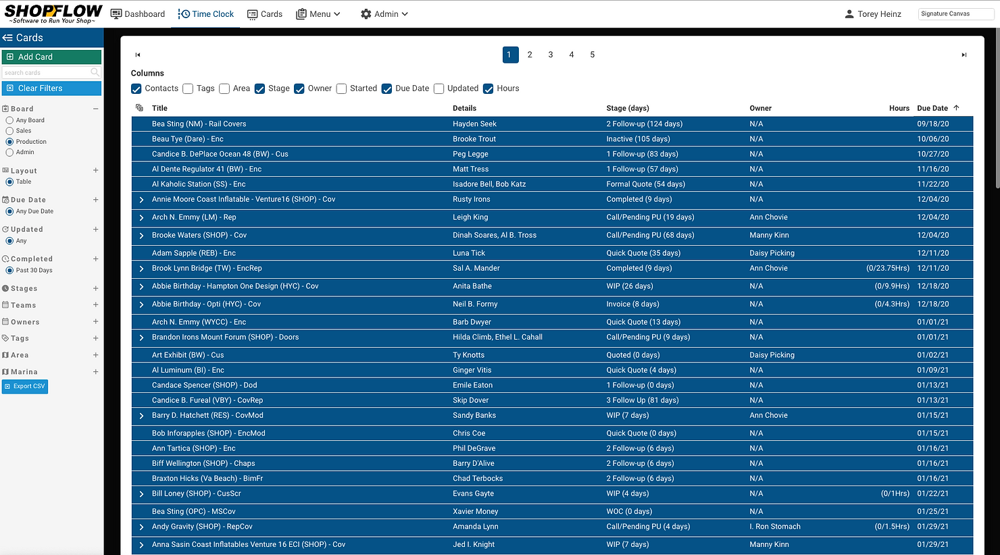

Shopflow has two main ways to view cards: as columns or in a table. The table view is great, but as more requests came in for more columns we needed a way to toggle which columns are displayed.

Once you find the set of columns you like Shopflow will remember them the next time you view the cards table.

The Currently available columns are: 
__Contacts:__ A comma separated list of contacts from the card details section 
__Tags:__ A list of tags currently applied the card 
__Area:__ Where is the work being preformed 
__Stage:__ The card's current stage and the numbers of days in that stage 
__Card Owner:__ Who is responsible for this card at top level 
__Started:__ Date the card/job was started 
__Due Date:__ Date the card is due 
__Updated:__ When was time last time this card was saved 
__*Hours:__ How many actual/planned hours does this card have

__\*__ Not all of these columns are available for every account.

