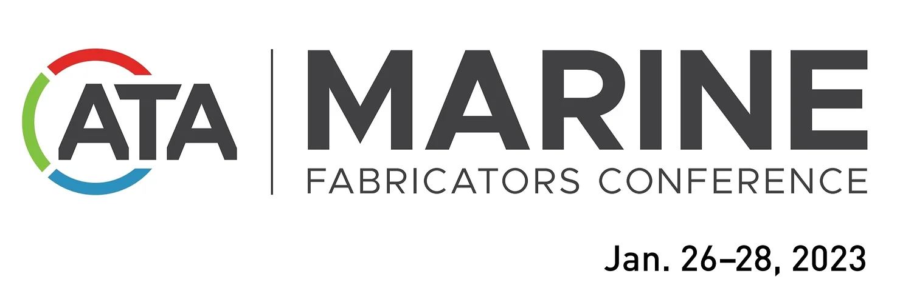

Are you looking to streamline your marine canvas shop and take your business to the next level? Look no further than Shopflow, the leading software for marine canvas shops.

At the Marine Fabricators Conference 2023, taking place from January 26th to 28th at the Sheraton New Orleans in New Orleans, LA, attendees will have the opportunity to see Shopflow in action and learn about all of its features.

One of the key benefits of using Shopflow is its ability to automate many of the repetitive and time-consuming tasks that are commonly associated with running a marine canvas shop. By automating these tasks, Shopflow helps to increase efficiency, reduce errors, and free up more time for shop owners to focus on growing their businesses.

One of the key advantages of Shopflow is how it simplifies and streamlines many of the technical aspects of running a marine canvas shop. This can help to make your operations more efficient and accurate which in the long run it can help you to lower costs and increase revenue.

So if you're a marine canvas shop owner or manager, make sure to visit the Shopflow booth at the Marine Fabricators Conference 2023 to learn more about how this powerful software can benefit your business. With Shopflow, you'll be able to take your marine canvas shop to the next level, and take your business to the next level.

